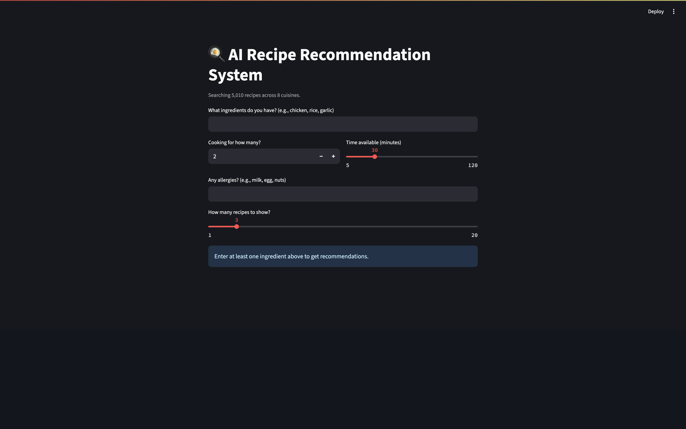
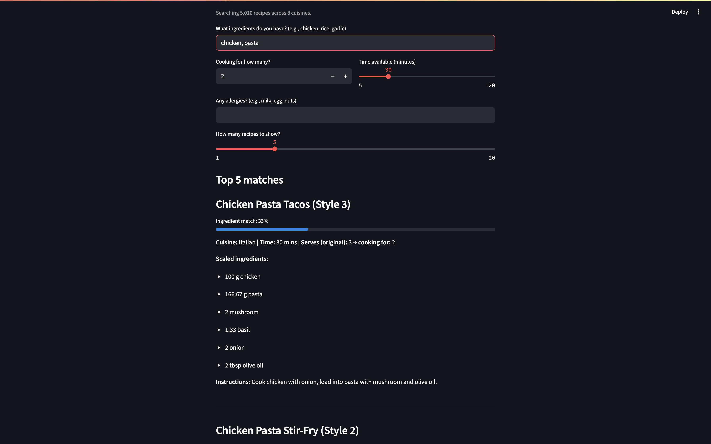

# AI Recipe Recommendation System

A Streamlit web app that recommends recipes based on the ingredients you already have. It ranks recipes by an **ingredient-match score**, scales ingredient quantities to your serving size, filters by cooking time, and flags allergens with suggested substitutions. Searches a dataset of **5,000+ recipes** across 8 cuisines.

## Demo

Enter what's in your kitchen (e.g. `chicken, pasta`), set how many people you're feeding, your time limit, and any allergies. The app returns the best-matching recipes ranked by how much of each you can already make, with quantities scaled to your serving size.





## Features

- **Ingredient match scoring** — each recipe gets a score (0–100%) for how many of its ingredients you already have, and results are ranked best-first.
- **Serving-size scaling** — ingredient quantities are automatically scaled from the recipe's original servings to the number of people you're cooking for.
- **Time filter** — only shows recipes you can make within your available time.
- **Allergy handling** — recipes containing your listed allergens are filtered out, and common allergens come with suggested substitutions.
- **5,000+ recipes**, 8 cuisines (Italian, Mexican, Indian, Chinese, American, Thai, Mediterranean, Japanese).

## How the matching works

The core of the app is a simple, explainable match score. For each recipe:

```
match score = (number of the recipe's ingredients you have) / (total ingredients in the recipe)
```

So if a recipe needs 4 ingredients and you have 2 of them, it scores 0.5 (50%). The app computes this for every recipe, filters out ones over your time limit or containing an allergen, then sorts by score so the recipes you can most easily make appear first. Partial words are handled too — "chicken" matches a recipe's "chicken breast".

This keeps the logic transparent: the "match %" shown next to each recipe is exactly this fraction, not a black box.

## Project structure

```
recipe-recommender/
├── app.py            # Streamlit app (UI + matching logic)
├── recipes.csv       # recipe dataset (5,000+ rows)
├── requirements.txt
└── README.md
```

## Dataset

The dataset (`recipes.csv`) is a **generated dataset** of 5,000+ recipes built from real ingredients, cuisines, and cooking methods, in this schema:

| column | description |
|---|---|
| `title` | recipe name |
| `ingredients` | comma-separated ingredient names (used for matching) |
| `instructions` | cooking steps |
| `cuisine` | cuisine type |
| `servings` | how many the original recipe serves |
| `time_minutes` | total time in minutes |
| `ingredient_list` | ingredients with quantities (used for scaling) |

It was generated for demonstration purposes; the same app works with any CSV in this format, including real recipe datasets.

## Setup

```bash
git clone https://github.com/vineethaponugoti7-cpu/recipe-recommender.git
cd recipe-recommender
pip install -r requirements.txt
```

## Usage

```bash
streamlit run app.py
```

This opens the app in your browser. Enter your ingredients, set the filters, and browse the ranked recommendations.

## Tech stack

- **Python**
- **Streamlit** — web UI
- **pandas** — data loading and filtering
- **re** (regex) — parsing and scaling ingredient quantities

## Limitations & future work

- Matching is based on ingredient-name overlap, so it doesn't understand that "scallion" and "green onion" are the same thing. A synonym map or embeddings would improve this.
- The dataset is generated for demonstration; swapping in a large real-world recipe dataset would make recommendations richer.
- Possible extensions: dietary filters (vegetarian/vegan), nutrition info, and "what one extra ingredient unlocks the most recipes" suggestions.

